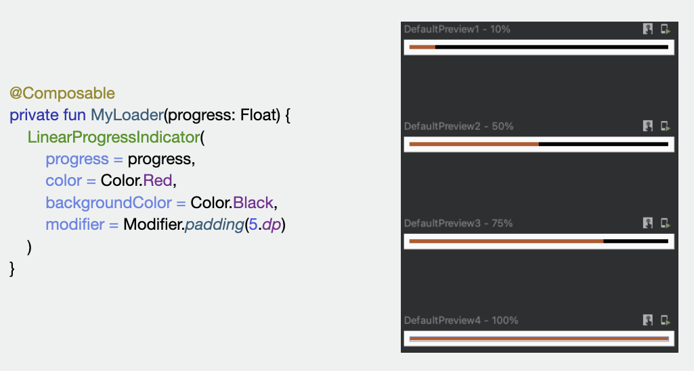

## Architecture and State

This repository is based on a talk I gave for the Compose Camp online event promoted by the Kotlin La Paz community.
The Architecture and State topic is based on the third pathway of the Jetpack Compose course from Google. You can check it out here: [Jetpack Compose for Android Developers](https://developer.android.com/courses/jetpack-compose/course).

 

---

 

## Main concepts
### State
It answers the questions: How is my app right now? What is showing? What is the value of the variable X?
The state is the configuration or value of our app in a given moment of time.

 

### Event
Any interaction with our app. It can be done by a user or from an external component. *An event can change the state of our app*.

 

### Unidirectional Data Flow | UDF
Design pattern that can be applied with the Declarative Paradigm. It decouples the UI from who is handling the *state*. It allow us to write unit tests for each layer of our presentation side, that is, tests for our composable functions and tests for our UI logic or State logic handler.

 

### Why the *state* is important in Jetpack Compose?
- The state defines the UI.
- The *composable* functions depends on variables that have an state.
- The canvas drawn is a graphic representation of our app state.

 

 

---
### Useful Links
- [Jetpack Compose for Android Developers](https://developer.android.com/courses/jetpack-compose/course)
- [Architecture and State | Pathway 3](https://developer.android.com/courses/pathways/jetpack-compose-for-android-developers-3)
- [Compose Camp | Kotlin La Paz](https://kotlinlapaz.github.io/ComposeCamp/)
- [Presentation of the talk I gave (Spanish)](https://speakerdeck.com/jflavio11/architecture-and-state-in-jetpack-compose)